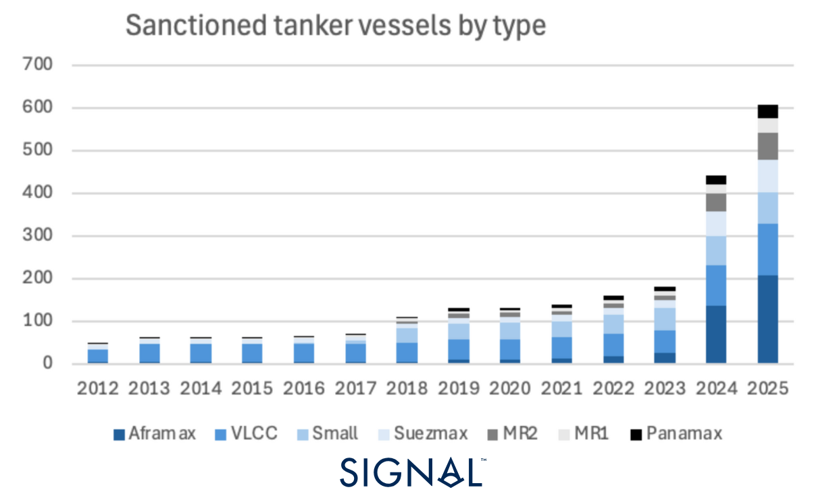
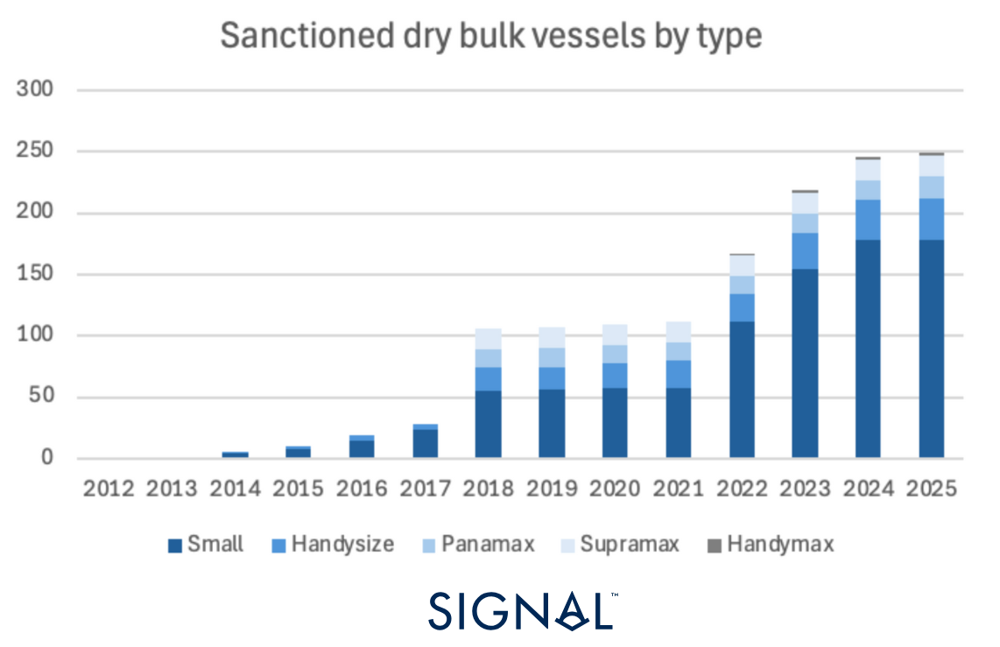
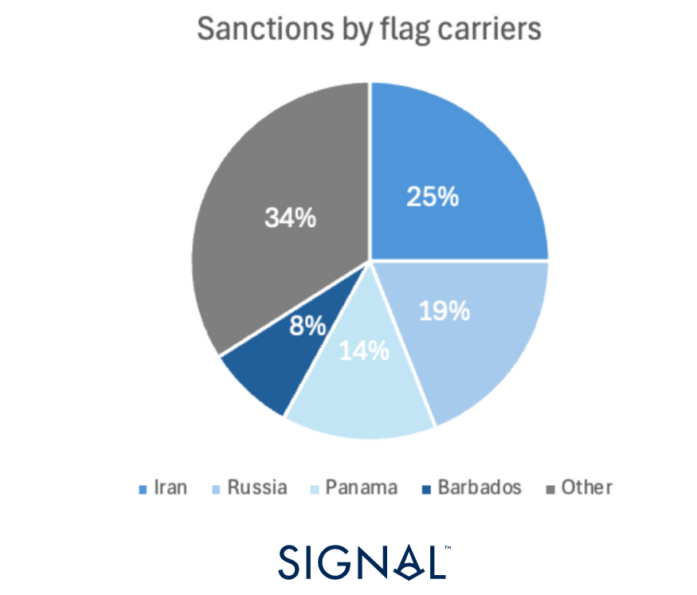

# Tracking Sanctions at Sea

**Date**: April 8, 2025 | **Category**: Market Insights | **Section**: Newsroom | **Source**: [https://www.thesignalgroup.com/newsroom/tracking-sanctions-at-sea-aframax-surge-and-geopolitical-fallout](https://www.thesignalgroup.com/newsroom/tracking-sanctions-at-sea-aframax-surge-and-geopolitical-fallout)

---

Through our analysis, we provide commentary that charts the rise of vessel sanctions. Leveraging a newSignal Ocean Platform feature, you can seamlessly explore market trends, track the evolving sanctioning patterns against vessels, and monitor the latest developments. As geopolitical tensions drive sanctions, cargo, and freight costs continue to fluctuate; this tool enables valuable insight into this ever-changing landscape. In this piece, we illustrate how Aframaxes are disproportionately represented within the sanctioned fleet.

## Sanctioned vessels: Definitions and overview

The Signal Ocean Platform empowers maritime professionals with up-to-date, actionable insights by tracking sanctioned vessels flagged by at least one global authority, with data from the EU, UN, OFAC, and OFSI. Our comprehensive sanctions data spans back to 2012, with a significant increase following the Russian invasion of Ukraine and a notable spike in 2018 tied to renewed OFAC sanctions on Iran. Since 2022 alone, we've identified hundreds of vessels newly added to sanctions lists, giving critical visibility to manage risk, maintain compliance, and make informed decisions.

‍

.png)
*Signal Figure*

A vessel is sanctioned for three main reasons:

- She is owned or linked to a sanctioned individual.
- She has been found or suspected of transporting material to or from sanctioned countries.
- She has been used to facilitate activities that are prohibited by sanctions or to transport illegal goods.

## Sanctioned vessel types

Given the targeted nature of the sanctions, certain vessel types and classes have been more directly impacted than others. Tankers make up less than 30% of the total vessel population within our platform, yet, tankers account for 65% of the sanctioned vessels. Within the tanker classification, there has also been a steady increase in Aframax vessels coming under sanctions. In 2022, when sanctions first started to expand, only 18 Aframaxes were under sanctions, accounting for 9% of the total sanctioned tanker population. By 2025, this has grown to over 200 Aframaxes, making up 34% of the sanctioned tanker population, by far the largest group, having overtaken VLCC.  Before 2024, VLCCs were the most sanctioned vessel type, given that they are used for Iranian oil exports. Aframax vessels now account for the largest vessel type of any sanctioned vessel, at 22%

This growing number of Aframaxes sanctioned is due to them engaging in sanctiobale trade. Aframaxes are best suited to transporting oil products from ports and regions under wider economic sanctions, such as the Black Sea, a key region for Russian oil exports. In addition to this, Aframaxes are also used in short-haul deliveries to larger vessels in neutral waters to obscure the origin of the cargo. By limiting the number of Aframaxes available, this practice becomes more difficult and impacts sanctioned nations' exports.

‍

*Signal Figure*

Dry bulk vessels make up 51% of the total vessel population within our platform, but account for just 26% of the total sanctioned population. Within this group, vessels classified as small make up the most significant percentage, 71%. These vessels have the flexibility to carry many different cargo types, so placing them under sanctions reduces the ability of the sanctioned entities to react to market movements, furthering the economic impact of the sanctions.

‍‍

*Signal Figure*

‍

## Other sanctioned vessel characteristics

Sanctions on vessels are also concentrated on a few flag carriers. Vessels flying the Iranian and Russian flags received 25% and 19% of the sanctions, respectively. Sanctions are heavily concentrated on just four flags: Iran, Russia, Panama, and Barbados, which combined account for two-thirds of all the sanctions issued.

Panama and Barbados seem odd companions to Iran and Russia in this list, but they have often provided a flag of convenience (FOC) in the past for foreign-owned vessels that wish to register outside their domestic territory. While some of the reasoning for a vessel seeking an FOC is purely economic, to avoid liabilities or taxes, in more recent times, this practice has been adopted by those wanting to distance themselves from international scrutiny. Panama has begun to respond to the pressure from the international community and limit some registrations, but the country remains the flag with the third-highest number of sanctions on our platform.

*Signal Figure*

## Key takeaways

As of now, the sanctioned vessel count sits close to 1,000 individual vessels, around 1.5% of the total vessel population. The targeted nature of vessel sanctioning has led to more tankers being placed under sanctions than any other vessel class. Within this group, Aframaxes continue to be the main target. This is due to how they are suited to operate in regions like Black Sea ports, a key region for Russian crude exports. Aframaxes now account for 22% of the total sanctioned vessel population, up from 5% in 2022, having overtaken VLCC as the dominant vessel type under sanctions in 2024.‍Geopolitical tensions and the changing nature of relations between countries will continue to drive sanctions, which have far-reaching effects on freight rates and commodity prices.

Stay updated with platform enhancements, insights, and market analysis. For demo inquiries,reach outto us and visit theSignal Ocean Newsroomfor the latest updates on market trends and platform developments. To check out our previous newsroom articleclick here.
