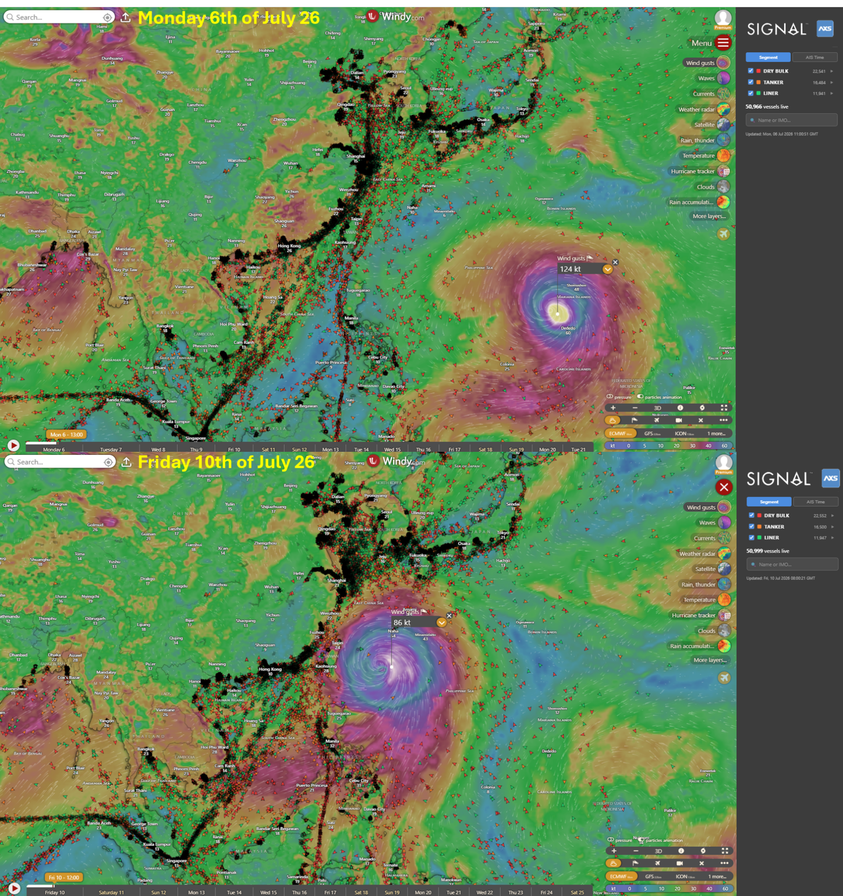
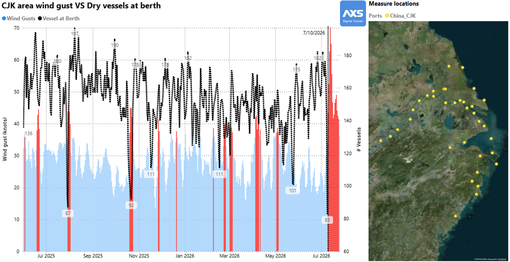

# Typhoon Bavi Hits Taiwan & China, Disrupting Pacific Vessel Supply (Update)

**Date**: July 10, 2026 | **Category**: Market Insights | **Section**: Newsroom | **Source**: [https://www.thesignalgroup.com/newsroom/typhoon-bavi-hits-taiwan-china-disrupting-pacific-vessel-supply-update](https://www.thesignalgroup.com/newsroom/typhoon-bavi-hits-taiwan-china-disrupting-pacific-vessel-supply-update)

---

## Typhoon Bavi Hits Taiwan & China, Disrupting Pacific Vessel Supply (Update)

As reported earlier this week onSignal Newsroom, Typhoon Bavi is currently impacting navigation around Taiwan and Shanghai area despite Bavi has decreased its intensity. Now rates it as a Category 1 typhoon, according toECMWFas shown onWindyand with Signal & AXSMarine Windy.com plugin.

*Signal Figure*

Several safety bulletins have been issued byChina Maritime Safety Administrationto restrict navigation during the Typhoon.

The impact is already visible in the dry bulk segment: vessel activity around Shanghai has fallen by 50%, dropping from 180 vessels at berth earlier this week to 83 on Friday, 10th of July.

*Signal Figure*

Winds are expected to ease as Bavi makes landfall but will remain elevated until Monday/Tuesday next week, continuing to disrupt port operations from Shanghai to Qingdao.

‍
