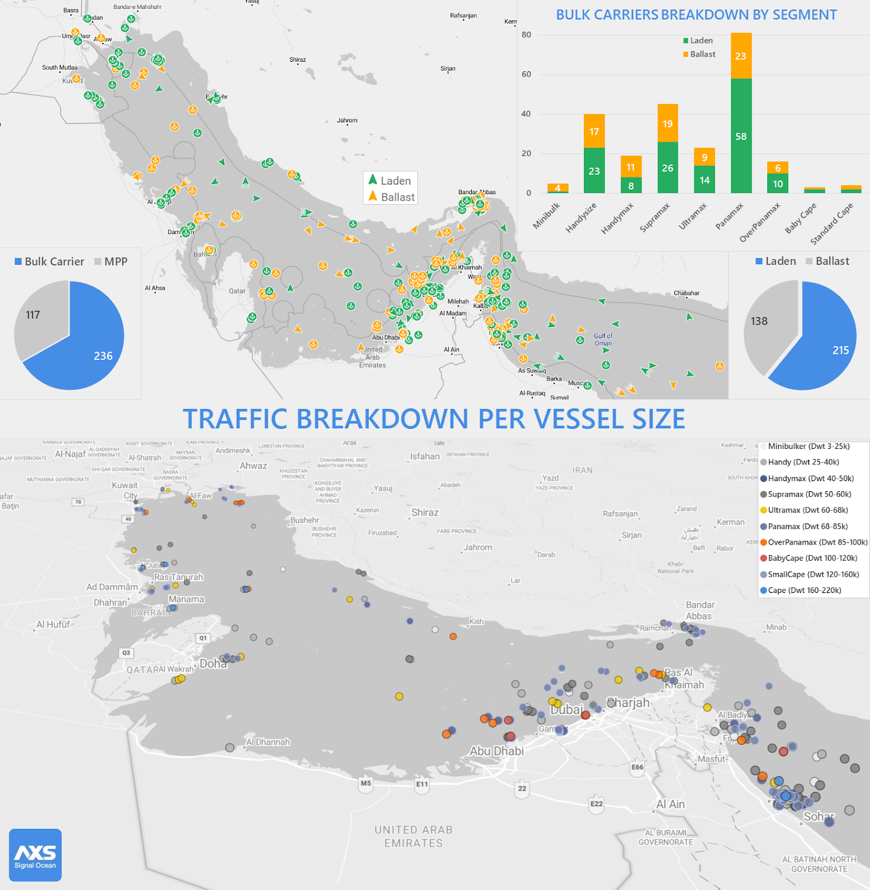
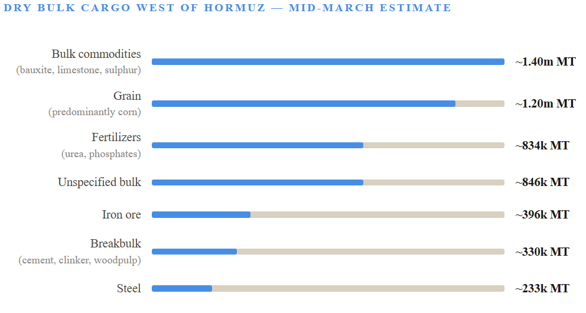
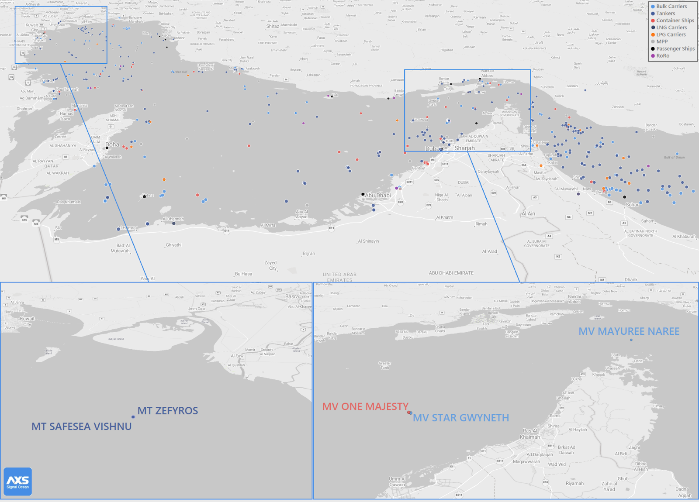
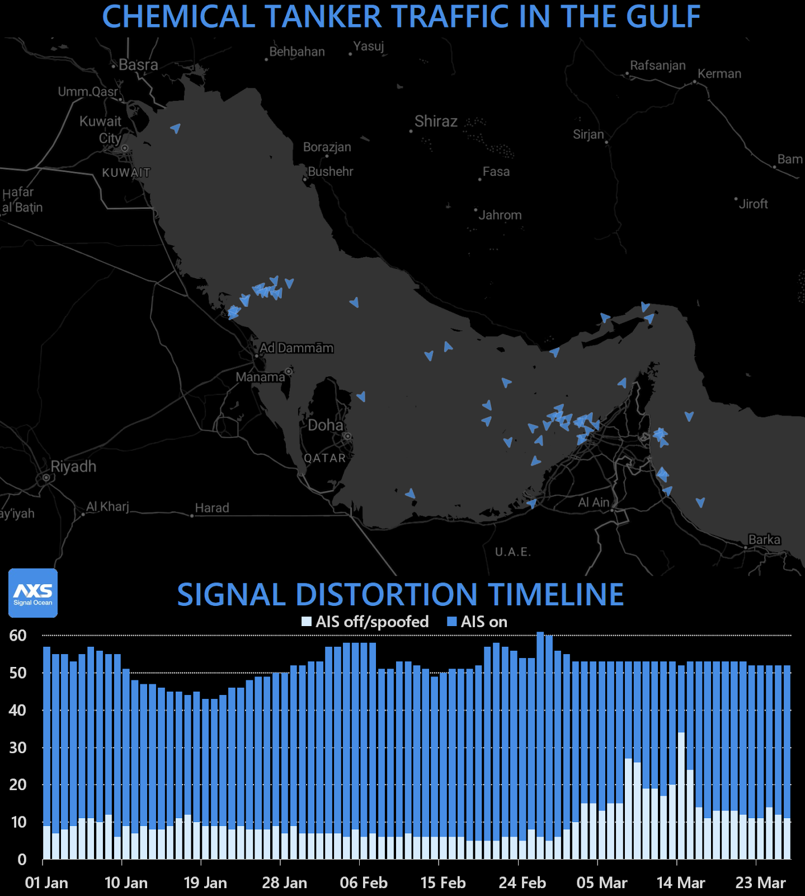
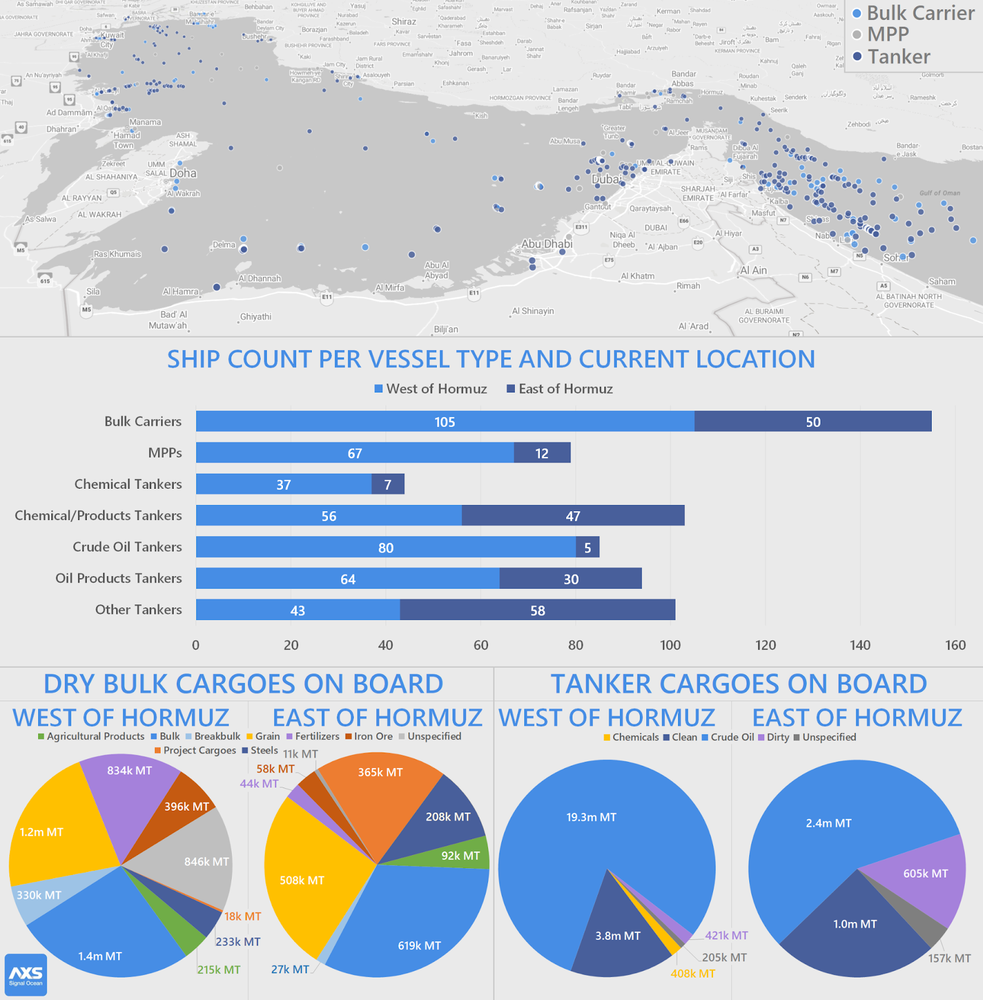

# When the Gulf Went Still

**Date**: April 8, 2026 | **Category**: Market Insights | **Section**: Newsroom | **Source**: [https://www.thesignalgroup.com/newsroom/when-the-gulf-went-still](https://www.thesignalgroup.com/newsroom/when-the-gulf-went-still)

---

## One month of AIS-derived data from the world's most consequential chokepoint and what it revealed about a dry bulk market frozen in place.

Оn 28 February 2026, the Persian Gulf was running a normal book of business. Panamaxes were completing grain discharges at Bandar Imam Khomeini. Supramaxes were working fertilizer parcels. Handysizers were loading industrial minerals for Southeast Asian ports. Then the United States and Israel launched coordinated strikes on Iran — including the killing of Supreme Leader Ali Khamenei — and within seventy-two hours, the Islamic Revolutionary Guard Corps had formally declared the Strait of Hormuz closed. Only four vessels had crossed in either direction. The month that followed was unlike anything the dry bulk market had seen.

Iran's IRGC transmitted warnings via VHF radio to vessels in the Strait, stating that no ship was permitted to pass. By 4 March, IRGC officials claimed "complete control" of the waterway. The self-imposed closure that followed was not the result of physical obstruction alone — it was the result of commercial operators making a rational calculation that the risk of transit outweighed any freight premium. This review draws on AXSMarine's AIS-derived tracking data, collected continuously throughout March, to document what that calculation meant for the dry bulk fleet: how many vessels were trapped, what cargoes they were carrying, how the flow of transits evolved, and what the data tells us about a market that never fully stopped — but came closer to it than at any point in recent memory.

## The Freeze

In early March, AXSMarine had identified 353 dry bulk and multipurpose vessels inside the Gulf — 236 bulk carriers and 117 MPPs. Of those, 144 bulk carriers and 71 MPPs were laden: cargo on board, nowhere to go. The remainder were ballasting, caught mid-reposition at exactly the wrong moment.

To understand why this number matters, it helps to know what normal looks like. In the months preceding the conflict, between 20 and 30 dry bulk vessels crossed the Strait of Hormuz per month — a modest but economically significant flow underpinning grain, fertilizer, and industrial mineral supply chains between the Gulf and Asia. That flow had not slowed. It had stopped.

Over the following two weeks, as the broader situation failed to normalise, the total fleet of all vessel types west of Hormuz continued to grow. By 9 March it had reached 1,061 vessels. By 12 March, 1,062 — the peak recorded during the month. The Gulf had effectively become a holding area for a substantial fraction of global merchant shipping.

## The size picture

The trapped dry bulk fleet was not concentrated at one end of the size spectrum. Panamaxes (68–85K dwt) and Supramaxes (50–60K dwt) accounted for the largest shares, reflecting their role as the primary workhorses of Gulf commodity trades. Handysizes (25–40K dwt) were also well represented.

At the upper end, four standard Capesize bulkers in the 170–180K dwt range were among the largest vessels present — a reminder that the Gulf does attract larger tonnage for bauxite, limestone, and bulk mineral exports, even if it is not a traditional Capesize routing.

*Signal Figure*

## What Was Locked Inside

Vessel counts give a sense of scale. Cargo volumes tell the supply chain story. AXSMarine's mid-March commodity analysis translated the trapped dry bulk fleet into tonnage terms — and the picture it produced was of a disruption hitting several import markets at once.

*Signal Figure*

The grain and fertilizer figures deserve particular attention, because they are time-sensitive in a way that bulk minerals and steel are not. The 1.2 million MT of grain cargoes trapped inside the Gulf — predominantly corn — represent delayed deliveries to import markets in South and Southeast Asia at a moment in the calendar when agricultural buyers are building pre-season stocks. The roughly 834,000 MT of fertilizers, largely urea with smaller phosphate volumes, arrived at Hormuz just as Northern Hemisphere farmers were approaching spring application windows. Delay in both cases does not simply push a shipment back by a week — it can compress or disrupt input supply chains with consequences that extend well beyond the port gate.

Vessels that had already cleared the Strait before the conflict provided some buffer. As of mid-March, a further 618,700 MT of bulk commodities and 508,200 MT of grains were already east of Hormuz, in transit toward destination markets. That supply was moving. But it was not enough to absorb an extended closure.

## A Trickle, Not a Flow

The most operationally significant question throughout March was not how many vessels were trapped — it was how many were moving, and at what rate. AXSMarine tracked every crossing through the Strait, and what that data showed was a corridor that never fully closed but never came close to functioning normally.

- 28 Feb – 5 March

Conflict begins. In the first 72 hours, just four vessels cross the Strait in either direction. 353 dry bulk and MPP vessels confirmed inside the Gulf by 5 March.

- 9 March

Over the prior weekend, seven vessels transit in total — five dry bulk carriers and two tankers. The overall trapped fleet reaches 1,061 vessels. AIS signal disruption peaks: 323 vessels are dark or transmitting unreliable positions.

- 11–12 March

The most violent 24-hour period of the month. The Thai-flagged bulk carrier MAYUREE NAREE (30K dwt) is struck by a projectile while transiting the Strait; 20 crew are rescued by the Omani Navy, three remain missing. The STAR GWYNETH (87.2K dwt Panamax, owned by Star Bulk Carriers) is hit in the hold area while anchored northwest of Dubai; all crew safe.

*Signal Figure*

The container ship ONE MAJESTY sustains minor damage above the waterline near Ras Al Khaimah. Separately, near Basra, two tankers — SAFESEA VISHNU and ZEFYROS — are struck by Iranian sea drones while conducting a ship-to-ship transfer of naphtha; both vessels are engulfed in flames. One Indian crew member aboard SAFESEA VISHNU is killed. Seven vessels successfully transit the Strait in the same 48-hour window. Trapped fleet reaches its peak: 1,062.

- 13–19 March

25 vessels cross over the week to 19 March. Panamax bulk carriers dominate outbound movements — Greek and Chinese operators accounting for most transits. The STAR GWYNETH crosses and proceeds to drydock in Oman. Around 13 March, the IRGC establishes what analysts describe as a tolled passageway through Iranian territorial waters around Larak Island — requiring vessels to submit documentation, and in some cases payment, before being cleared. Iranian attacks on merchant ships appear to slow following the tollbooth's opening. The last confirmed strike in the period occurs on 19 March.

- 19–27 March

A further 15 bulk carrier and MPP crossings recorded. 11 are outbound. Only 4 are inbound. The dry bulk and MPP fleet west of Hormuz stands at 319 vessels — down from the March 5 peak but still representing an enormous accumulation of displaced tonnage.

The pattern across these five data points is unambiguous. Traffic through the Strait never reached zero, but it never approached anything like operating conditions. Across the full month, vessels exited consistently faster than they entered — and the gap between outbound and inbound flows widened rather than narrowed as March progressed.

By late March, 157 of the 319 remaining bulk carriers and MPPs inside the Gulf were ballasting — vessels that had already discharged their cargo and were simply waiting for a safe window to leave. The commercial work in the region was largely done. What remained was a fleet in limbo, measuring risk against urgency every day.

## Who Was Willing to Move

Transit data is not just a count of crossings — it is a record of who, under what conditions, decided that the risk was acceptable. And in March 2026, that decision was not being made uniformly across the industry.

Among the dry bulk operators that exited between 15 and 19 March, Greek and Chinese owners were notably prominent. The vessels were almost entirely Panamax-class — MDL KAMRAN, LH ANTHEA, MINOAN SKY, GEORGIA T, BAILIAN STAR, MINOAN DIGNITY, BROAD RICH — all between 72K and 81K dwt. Their size concentration is not coincidental: Panamaxes are the primary lifting vessel for grain and fertilizer exports out of Gulf ports, and operators in those trades had spent weeks with vessels idle after completing discharge. The pressure to exit was acute.

Of the four vessels that entered the Gulf in the week to 27 March, two carried grain — NJ JUPITER (56K dwt, ~51,000 MT of corn) and GIACOMETTI (81.7K dwt, subsequently discharging ~74,000 MT of grains at Bandar Imam Khomeini). The other two were ballasting.

That any inbound grain fixture was concluded at all speaks to end-user urgency on the receiving side — not to any broad normalisation of commercial conditions at the Strait.

Several of the late-March crossings involved vessels transmitting irregular or potentially spoofed AIS signals — an indication that even operators willing to transit were not always doing so transparently. This mirrors a pattern visible in the tanker segment throughout the month, where by late March analysts estimated that over 80% of transits had some form of Iranian nexus, compared to roughly 15% in the months before the conflict. The residual flow through a high-risk corridor, when enough conventional operators step back, increasingly reflects the risk appetite of the least risk-averse participants in the market.

A parallel development added further complexity to the late-March picture. On 26 March, Iran's Foreign Minister announced that vessels owned by China, Russia, India, Iraq, and Pakistan would be permitted to transit. Malaysia and Thailand secured similar arrangements through separate diplomatic channels. These exemptions were narrow and explicitly subject to change — but they were also the first signal that passage through the Strait was being managed as a selective geopolitical instrument rather than a blanket prohibition.

## When the Signal Disappears

Running beneath every data point in this review is a complication that deserves its own treatment: the systematic degradation of AIS signal quality throughout March. As the disruption deepened, a growing share of the vessels inside the Gulf either switched off their transponders entirely or began broadcasting false or manipulated positions. By 9 March, 323 of the 1,061 vessels tracked were dark or suspected of spoofing. Among the dry bulk and MPP fleet specifically, 82 vessels were operating under blackout conditions by late March.

This is not a new behavior in high-risk maritime environments. AXSMarine has documented comparable patterns across different corridors and different threat contexts. During peak Somali piracy activity, vessels broadcast "Armed Guard On Board" messages as a form of deterrence. Tankers approaching Israeli ports in early 2024 routinely altered their AIS destination fields. In March 2026, two dry bulk carriers briefly changed their destination to "China Owner/Crew" — a detail that attracted significant media attention, though the underlying practice of using AIS messaging to communicate ownership or crew nationality under pressure has precedent.

What was different in March 2026 was the scale of outright signal loss. In the chemical tanker segment — a useful test case because it is smaller and therefore more legible — the disruption inverted the normal ratio almost completely. On 15 March, 37 of 52 chemical tankers tracked inside the Gulf were dark, compared to only 15 transmitting.

*Signal Figure*

## The Longer Imprint

As of late March, the headline numbers were edging in the right direction — 319 bulk carriers and MPPs west of Hormuz versus the early-March peak of 353, crossings continuing at a trickle — but none of the underlying conditions that produced the disruption had changed. The flow imbalance was not closing. The risk environment had not normalised. And the operators who had withdrawn from routine scheduling through the Strait were not yet back.

For the dry bulk market, the near-term effects are relatively legible. Vessels exiting the Gulf — predominantly Panamaxes that have completed discharge — will gradually reintegrate into global trading patterns, adding supply in basins where their absence had created tightness. That process will take weeks, not months, and its impact on spot markets will be modest and diffuse.

The supply chain effects are less tractable. Some of the grain and fertilizer cargoes that were due to load in Gulf ports during March did not load. Those fixtures may be rebooked at a later date, may be replaced with alternative origin volumes, or may simply be lost from this season's trade flow. Each outcome carries different implications for tonne-mile demand, for origin-market pricing, and for the agricultural buyers who depend on reliable input delivery timelines.

The fertilizer question is the one worth watching most carefully. Roughly 834,000 MT of fertilizer cargo was locked west of Hormuz as of mid-March - predominantly urea, with smaller volumes of phosphates — at a point in the calendar when buyers across South and Southeast Asia were building stocks for spring planting. The Gulf region accounts for roughly 30% of global seaborne fertilizer trade in normal times; urea prices had spiked close to 30% within weeks of the conflict's onset. For farmers in import-dependent regions, particularly across Africa and South Asia, the disruption arrived at the worst possible moment in the agricultural calendar.

*Signal Figure*

By 27 March, the situation had become urgent enough that Iran agreed to a UN request to exempt humanitarian aid and agricultural shipments from the transit restrictions — the first substantive breakthrough at the chokepoint in nearly a month. The UN Secretary-General had appointed a personal envoy specifically to negotiate the restoration of fertilizer flows, framing the issue as a systemic risk to global food production. Whether that exemption holds, widens, or collapses under the pressure of the wider conflict remains to be seen. But its very existence confirms what AXSMarine's cargo data had signalled weeks earlier: the 834,000 MT of fertilizer stranded west of Hormuz was not a shipping statistic. It was a food security problem in transit.

The Strait of Hormuz is always consequential. It carries roughly a fifth of globally traded oil, as well as meaningful volumes of LNG, LPG, and the dry bulk commodities this review has focused on. In ordinary times, that significance is priced into trade routes and risk frameworks as a chronic background condition. In March 2026, it became acute. What the data captured — vessel by vessel, crossing by crossing, signal by signal - was a market confronting, in real time, what it actually means when the Gulf goes still.Learn more aboutAXS Data & APIs.
