# Why China’s Crude Collapse Isn’t The Demand Story It Looks Like

**Date**: July 16, 2026 | **Category**: Market Insights | **Section**: Newsroom | **Source**: [https://www.thesignalgroup.com/newsroom/why-chinas-crude-collapse-isnt-the-demand-story-it-looks-like](https://www.thesignalgroup.com/newsroom/why-chinas-crude-collapse-isnt-the-demand-story-it-looks-like)

---

## The import mirage

Every few weeks a number lands that seems to settle the argument of China’s crude oil imports. The latest was showing imports falling to about 7.8 million barrels a day in May (as per China Customs), down from around 9.4 the month before and close to 11 a year earlier, a fall of nearly a third year on year.

## The headline that looks like a smoking gun

The tidy conclusion drawn almost everywhere was that Chinese demand is weak and dragging oil prices down with it. However, an import number and a demand number are not the same thing, and the space between them is where the truth sits.

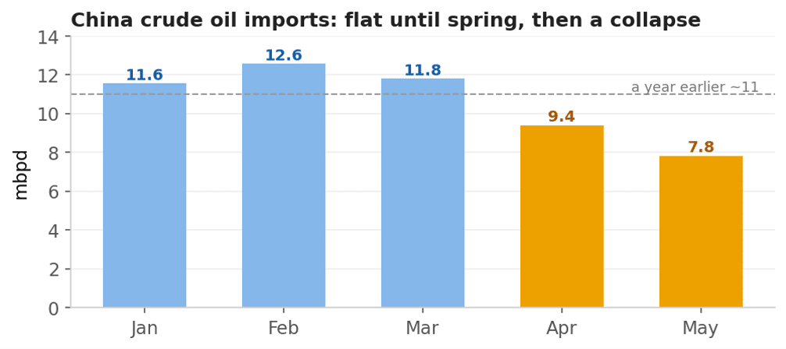
*Signal Figure*

## The backdrop has already turned

Start with the price, because it settles the largest question before we reach China at all. Over the period of those 5 months markets reacted very prudently. The world had enough inventory to absorb the shock, so prices correct back to 70’s region. The strait is reopening (maybe), Gulf exports are climbing back, and Brent has slipped to around 74 dollars, by the time of writing, with the talk turning from shortage to glut. A market that was genuinely short would not trade here. So the big call was right, and the interesting question narrows to something specific. Is China consuming less oil, or simply buying less?

## What the balance actually shows

Physical crude obeys one unbreakable rule. Whatever a country produces, plus whatever it imports, minus whatever its refineries run, has to go into storage or come out of it. Running China’s monthly numbers through that identity and the weak-demand reading falls apart.

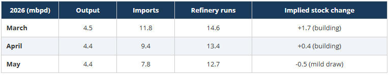
*Signal Figure*

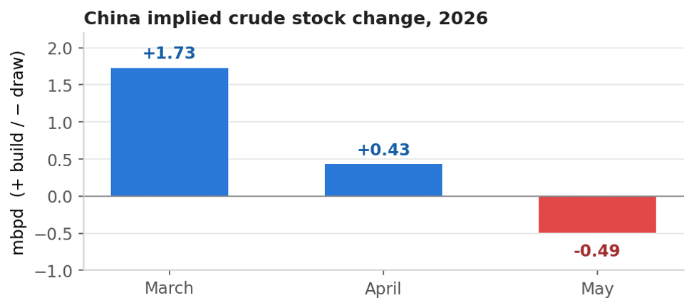
*Signal Figure*

Imports did collapse, from nearly 12 million barrels a day in March to under 8 by May. Yet right through March China was still importing far more crude than its refineries could use and putting the surplus into tanks at close to 1.7 million barrels a day. It kept building in April. Only in May did the balance tip into a draw, and a gentle one at that. China was stocking up into the disruption, which is how a buyer behaves when it sees a squeeze coming and decides to get ahead of it.

The year-on-year comparison makes the same point even more plainly. This May, China imported about 3.2 mbpd less crude than a year earlier. That looks like a demand crash. It is not, and the reason is simple once you see what imports actually do.

Imports do two jobs at once: they feed the refineries, and they fill or empty the storage tanks. So before a fall in imports can tell you anything about demand it has to be split between those two parts. Only about 1.3 mbpd of the drop is China running less crude through its refineries, and that is the only part that reflects less oil actually being used. The other 1.9 mbpd is simply the tanks changing role. A year ago China was buying extra to fill them, importing roughly 1.4 mbpd more than it was burning. This year it is doing the opposite, pulling about 0.5 mbpd back out. Swinging from filling tanks to emptying them lowers imports by about 1.9 mbpd on its own, with nobody consuming a drop less.

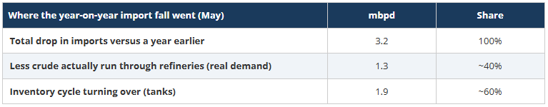
*Signal Figure*

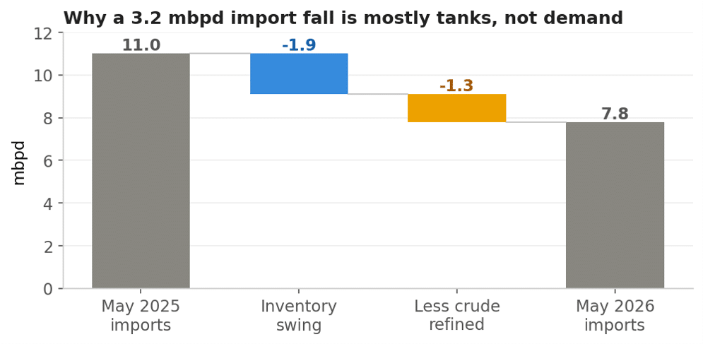
*Signal Figure*

So of the alarming 29 percent fall in imports, close to 60 percent is the tanks and only 40 percent, about 1.3 mbpd, is refineries running a little softer. That is the only part connected to consumption, and once the brief spring cut to export fuels is netted out, it points to China’s own oil demand running roughly 1.2 mbpd below a year earlier by May.

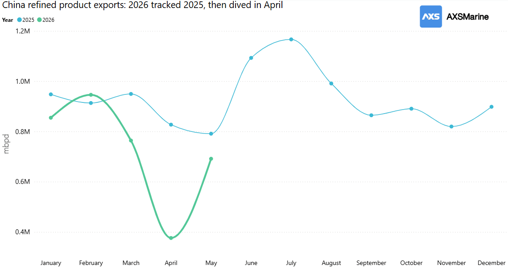
*Signal Figure*

## Two proposed buffers: production and inventories

So how China absorbed the shock? Pumping more of its own oil, and drawing on its stockpiles? One of them holds up while the other does not.

Its own production does not. You would expect a country suddenly importing far less to pump more at home to fill the gap. China did not. Output stayed flat, and its year-on-year growth faded to almost nothing:

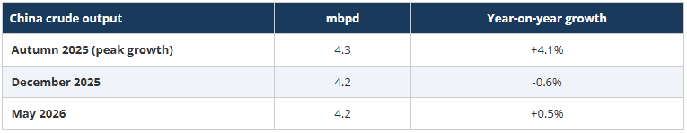
*Signal Figure*

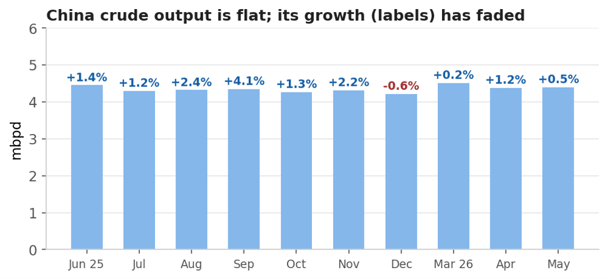
*Signal Figure*

At a flat rate of roughly 4.4 mbpd, the incremental barrel from China’s own fields is immaterial. It provides no meaningful cushion.

Inventories are the mechanism that does the work. The pattern of building stocks into the disruption is consistent with a buyer that entered the period well provisioned and has since drawn only marginally on its reserves. China began this episode with substantial inventory cover and has only recently begun to draw on it.

## Following the barrels

Waterborne crude to China fell by around 56% between January and June, with the drop concentrated in barrels that used to pass inside the Strait of Hormuz. Those went to almost nothing, offset by a rise in barrels loading just outside it. That is the rerouting caught in the act: crude shuttled out and transferred ship to ship rather than sailed through the strait.

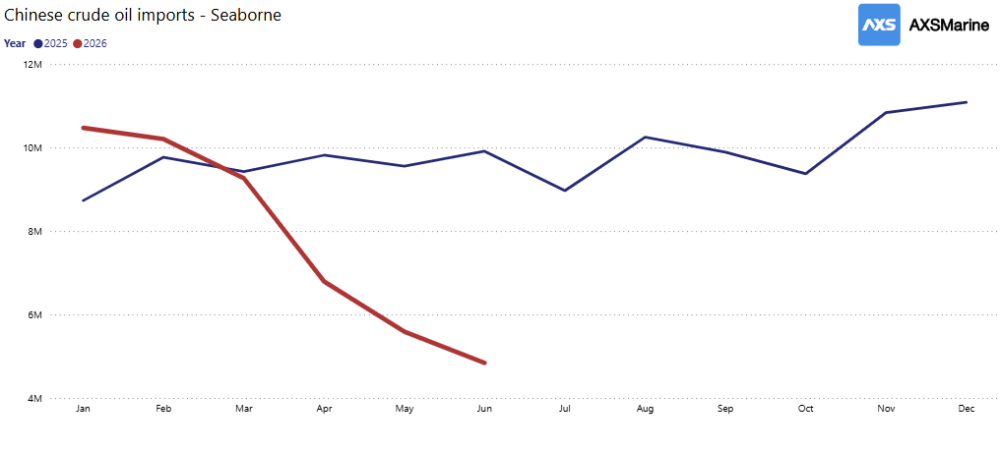
*Signal Figure*

The waterborne total runs a little below the customs total, by around 2.5 million barrels a day through the spring, and that gap is informative rather than a shortcoming. About a million of it is pipeline crude from Russia and Kazakhstan, which moves overland and by definition never crosses a vessel feed. The rest is the shadow trade, ship-to-ship barrels, mainly Iranian, blended and re-papered at transfer points off Malaysia and Indonesia before sailing to China as local-origin crude.

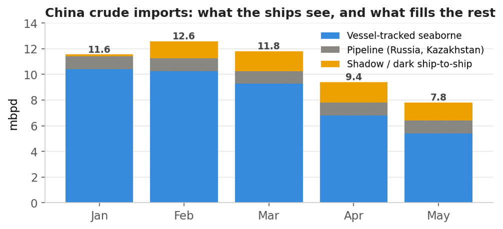
*Signal Figure*

The second pool is that shadow crude while it waits at sea. Iranian crude held in floating storage, staged mostly off Singapore and the Malaysian archipelago, was drawn from about 51 down to 27 million barrels over the first half of the year. The pace of that draw was front-loaded into the opening months, before the collapse in waterborne imports in April. In plain terms, China reached first for the buffer it had pre-positioned offshore, then let its imports fall. This pool sits upstream of the Chinese border.

## The same mirage, one commodity over

If there were a genuine demand shock, it should show up, in petrochemicals, and specifically in the two main cracker feedstocks. China’s combined LPG and naphtha arrivals fell by close to a million barrels a day between February and April. The reflexive reading is the same as for crude, that fewer feedstock barrels must mean weaker petrochemical demand. Yet China’s ethylene output did not fall. It held, and grew about two percent year-to-date through May, straight through the import cut. Imports fell but the crackers kept producing.

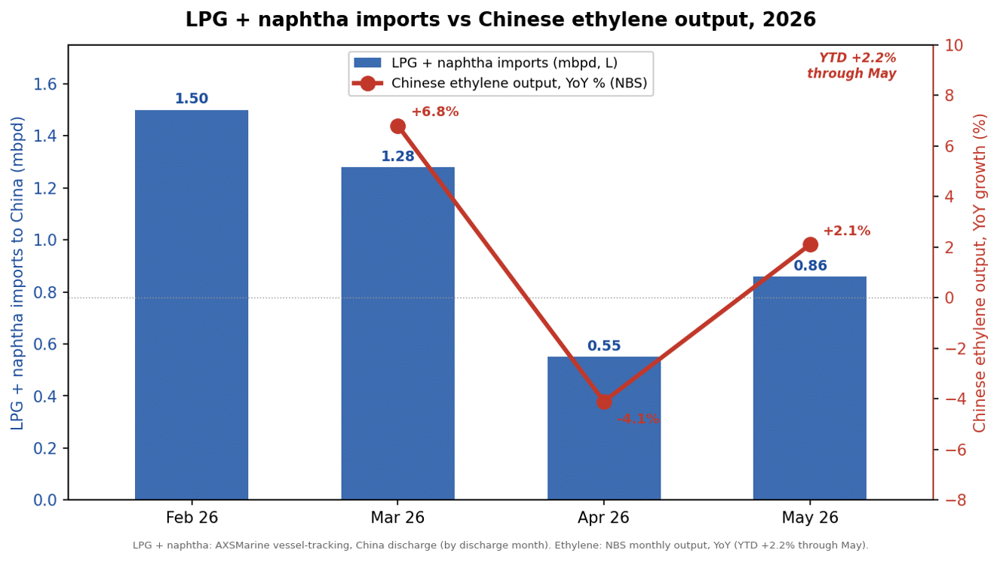
*Signal Figure*

The cut also fell where the economics said it should. Naphtha, the crude-derived feed, collapsed almost to nothing by April, while LPG, held up far better. The tempting explanation is that China simply switched to its coal-based ethylene production. The methanol-to-olefins units, the ones that buy methanol on the market, were squeezed to negative margins and many idled. Both the oil-linked feed and the methanol feed were hit at once by the same Gulf shock.

What held output up was the part of the system insulated from all of it. China’s integrated coal-to-olefins plants make their own methanol from their own thermal coal. They neither import naphtha nor buy methanol on the spot market, so the Gulf spike never reached their feed cost. They carried the base load, helped by new capacity and by drawing down feedstock stocks, the same destocking pattern the crude balance already showed. The petrochemical sector leaned on coal-based feedstock through the disruption and is expected to swing back to importing Middle Eastern LPG and naphtha as prices normalize. The imported-feedstock collapse, like the crude collapse, and it points to the same turn: When the Gulf normalizes and imported feed is competitive again, China’s feedstock imports rebound with it.

## The verdict

With the product-export data now on a clean year-on-year footing, cabotage stripped out, China’s own demand loss firms to about 1.2 mbpd by May. The export cut that briefly muddied this, about 0.5 mbpd at its April peak, had largely reversed by May, so it no longer softens the demand picture the way it seemed to earlier. And the comforting line that product margins have been easing does not hold for gasoline just now, where thin inventories have kept margins firm even as crude sits cheap. That is a refining-mix quirk rather than a sign of crude shortage.

The honest one-line summary is that China has come through this looking less like a victim and more like the best-prepared player at the table. Building crude while everyone else fretted, and drawing barely at all as prices fell. The signal worth watching is the moment China turns back to the market to refill the tanks it has been quietly living from. That is the buying that would put a real floor back under crude. Until then the puzzle of cheap oil during a conflict is barely a puzzle at all. The barrels were there, and the largest buyer had already filled its tanks.

*Methodology: AXSMarine'sTrade Flowsmodule was used for the vessel and commodity flows, floating storage and product-export figures in this analysis.
