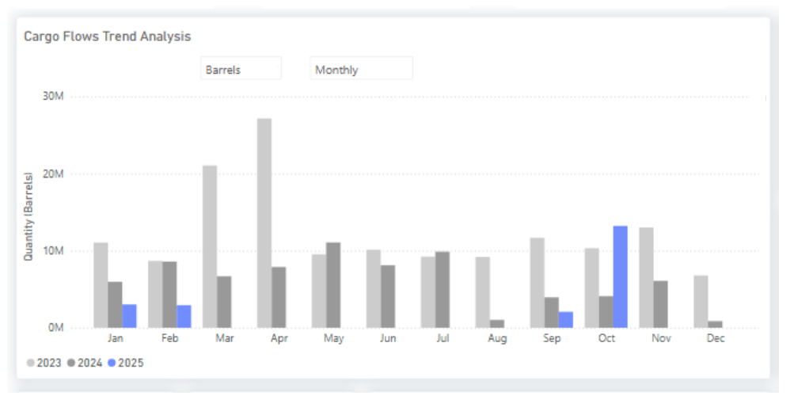

# WTI Returns to China

**Date**: October 6, 2025 | **Category**: Market Insights | **Section**: Newsroom | **Source**: [https://www.thesignalgroup.com/newsroom/wti-returns-to-china](https://www.thesignalgroup.com/newsroom/wti-returns-to-china)

---

## MARKET INSIGHTS: OIL FLOWSWTI returns to China

*Signal Ocean Oil Flows*

- U.S. Gulf loadings to China have shown renewed activity in October after a seven-month lull between February and September.PreliminarySignal Oceanestimatessuggest around seven VLCC-equivalent cargoes, roughly 13 million barrels, have been shipped from the U.S. Gulf to China so far this month.

- The recent widening of theBrent–Dubai Exchange of Futures for Swaps (EFS)made WTI-linked grades more economical for long-haul trades, briefly reopening the arbitrage window for Chinese refiners to re-enter the U.S. Gulf market on a price-driven basis this October.

- Still, freight stands as the ultimate arbiter. A near 36% quarter-on-quarter rise in VLCC rates from the U.S. Gulf to China has sharply reduced netbacks, undermining arbitrage opportunities even when paper spreads suggest otherwise.‍

Track in Real Time:

UseSignal Ocean Cargo Flow Trendsto filter byOrigin: U.S. GulfandDestination: China, Japan, Korea, Taiwan, India, switching betweenaggregatedandvoyage-levelanalytics.Stay ahead of the curve. Get access to theSignal Ocean Platform.
