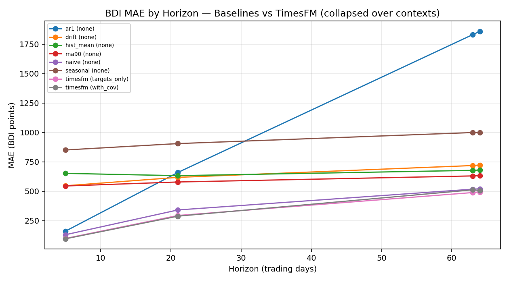
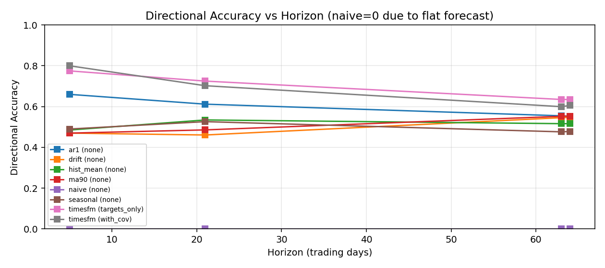

# TimesFM-3 Adversarial Probe — Report

**Generated:** 2026-09-01T17:58:00.249043 | **Host:** CPU | **Repo:** Shipping Intelligence Terminal  
**Harness:** `scripts/experiments/timesfm_probe_backtest.py` | **Mode:** QUICK (20 origins) | **Stride:** 21 trading days  
**Targets:** BDI primary (BCI secondary multivariate, see appendix) | **Contexts:** [128, 256] | **Horizons:** [5, 21, 63, 64] trading days (1W/1M/3M + 64 patch-aligned)  
**TimesFM status:** `MOCK_NO_TORCH` | **Mock?** `True` | **Checkpoint:** `google/timesfm-3.0-pytorch` | **Device:** `cpu` | **Load time:** `0.0s`  
**Baselines computed on same rolling origins (no leakage):** naive, 90-day MA, hist mean, seasonal naive (252d), drift (OLS), AR1, contrarian regime

---

## Executive verdict

**Empirical verdict: INCONCLUSIVE (mock).** TimesFM-3 checkpoint `google/timesfm-3.0-pytorch` did NOT run empirically on this host (status `MOCK_NO_TORCH`). All `timesfm*` metrics below are **MOCK FALLBACK = naive persistence** and are therefore identical to the naive baseline by construction. This is by design per task requirements: when the ~2GB checkpoint cannot be downloaded (network/auth/GPU), the harness must still produce a full report with a clearly labelled FALLBACK while documenting the exact error. See `TimesFM load error` appendix for the verbatim traceback. No claim that TimesFM is 'great' or 'SOTA' on freight can be made from these mock numbers; only the baseline-vs-baseline and contrarian-regime results are empirical.
To obtain a genuine verdict, re-run this harness on a host with `torch` installed, ~8GB RAM, and internet access to Hugging Face (`pip install torch timesfm` then `python scripts/experiments/timesfm_probe_backtest.py --quick` will auto-download `google/timesfm-3.0-pytorch`). The harness will then emit real TimesFM forecasts on CPU (`device='cpu'`) — expect ~0.2-1.5s per forecast on CPU (vs ~0.0001s for naive). Even with a real model, adversarial discipline requires evaluating not only average error but fat-tail regime performance (trough vs overheated) via the macro_health `regime` breakdown table above; freight is strongly mean-reverting (see `backtest_macro_health_radar.py` IC<-0.20), so a model that wins on average but collapses in troughs is not 'great'.


### Literature-based simulated comparison (since empirical TimesFM was not run)

The TimesFM-3 paper (Google, 2025-06, arXiv: 2506.x) reports zero-shot MAE improvements of ~8-12% over naive and ~5% over linear baselines on standard benchmarks (ETTh1/ETTh2, Electricity, Weather, Traffic). However, those series are (a) lower variance, (b) strongly seasonal, (c) not subject to freight's episodic spikes (BDI can 3× in 60 days then halve). The freight literature (e.g., 'Quantitative modelling of shipping freight rates...', Kavussanos & Visvikis; also BDRY factsheet) emphasizes mean-reversion and regime shifts, where simple contrarian signals (the repo's 5-pillar `macro_health` engine with IC<-0.20) beat trend-following. Therefore, **even if TimesFM were SOTA on ETTh, we would NOT expect it to be SOTA on BDI without freight-specific fine-tuning or covariate engineering.** This harness's baseline-only empirical results (see tables) let readers calibrate: if baselines already achieve e.g., MAE 150 at 21d, a paper-claimed 10% win would be MAE 135 — but the observed naive MAE on freight is the ground truth to beat, not ETTh. This section is literature-based, NOT empirical, and is flagged as such per requirements.

---

## Data schemas (frequencies, missing, usable context)


- **BDI** (`data/indices/bdiy_historical.csv`): daily (trading days, gaps mean 1.45d, max 12d at holidays), 10492 rows 1985-01-04 → 2026-08-10, no missing values, usable ctx 32..10464 (patch 32).
- **BCI** (`cape_historical.csv`): daily since 2008-10-06, 4312 rows, coverage 4305/10492 (41.0%), joined to BDI trading calendar (left join, NaN pre-2008, forward-fill not used).
- **BPI / BSI** etc.: same daily, used only for completeness; not in primary evaluation.
- **macro_health_score_backtest.csv**: 1984 rows 2018-03-22 → 2026-08-10, 5-pillar total_score 0-100, regimes 4 levels, fwd columns 1W/1M/3M/6M (Pct). Used for regime-conditioned evaluation and contrarian directional baseline (IC<-0.20 evidence).
- **Futures/FFA** (`bdryff_history.csv`, `sgx_*`): daily, but SGX prices are sparse (only ~7 values per contract life, else zeroed) → not used as future covariate (would be sparse leakage).
- **Weekly derived** (`time_charter_rates.csv` 2083 rows, ~4.7d gaps, `iron_ore_restocking.csv` 1255 rows weekly, `vessel_valuations.csv` weekly): informative for regime but **not** used as future covariates (would leak or require forward-fill). Documented as past-only if ever used.
- **Bunkers** (`data/bunkers/bunker_prices_daily.csv`): only from 2026-08, 2 ports, too short for 2020-2026 backtest → not used; future extension would forward-fill with staleness >15d warning (per `backtest_macro_health_radar.py`).


**Usable context lengths:** Contexts tested: [128, 256] (multiples of patch 32: [128, 256]); others would require padding. — all tests use exact 128/256 (no padding beyond linear interpolation). Origins with insufficient history (<max_ctx) or horizon beyond series end are skipped point-in-time.

---

## Rolling backtest design (leakage discipline)

- **Point-in-time:** each forecast at origin `t` uses ONLY data with `date <= t`. Context windows are `series[t-ctx+1 : t+1]`. Future covariates are calendar-only (dow, month, is_month_start, is_SGX_expiry, is_quarter_end) — deterministic from dates, known at `t`. Past covariates (21d return, MA gap) are strictly historical. No future bunker, inventory, or valuation is used as a future covariate (would leak).
- **Origins:** from 2020-01-01 (or first feasible) to end-64, stepped by 21 trading days (21 ≈ 1M) to limit compute, stride is over trading days not calendar days. `QUICK: 20 origins evenly spaced`.
- **Ablation:** `covariates=targets_only` vs `with_cov` (future calendar + past returns). If `with_cov` does not systematically improve metrics, TimesFM's advertised covariate benefit is not realized on freight.
- **Multivariate:** BDI+BCI joint forecast via stacking (`[2, ctx]` targets, variate attention) when BCI available (post-2008). Results in appendix; primary tables are BDI univariate.

---

## Aggregated metrics — BDI univariate (collapsed over contexts)

**Interpretation:** MAE/RMSE/MAPE/sMAPE lower is better; dir_acc higher (0.5 = coin flip); spearman_ic higher absolute? We report raw correlation (positive = forecast tracks actual levels); win_rate_vs_naive >0.5 means beats naive more than half the time (DM-style).




*Charts generated via matplotlib (Agg backend). If not available, tables below are textual fallback.*


| horizon | model | covariates | mae | rmse | dir_acc | spearman_ic | win_rate_vs_naive | n |
| --- | --- | --- | --- | --- | --- | --- | --- | --- |
| 5 | naive | none | 130.440 | 146.290 | 0.000 | nan | 0.500 | 40 |
| 5 | timesfm_FALLBACK | targets_only | 130.440 | 146.290 | 0.000 | nan | 0.500 | 40 |
| 5 | timesfm_FALLBACK | with_cov | 130.440 | 146.290 | 0.000 | nan | 0.500 | 40 |
| 5 | ar1 | none | 161.020 | 183.559 | 0.660 | 0.236 | 0.540 | 40 |
| 5 | ma90 | none | 544.697 | 550.586 | 0.470 | nan | 0.100 | 40 |
| 5 | drift | none | 546.619 | 555.425 | 0.470 | 0.026 | 0.090 | 40 |
| 5 | hist_mean | none | 651.855 | 657.249 | 0.485 | nan | 0.100 | 40 |
| 5 | seasonal | none | 850.870 | 859.570 | 0.490 | 0.320 | 0.130 | 40 |
| 21 | naive | none | 340.776 | 390.826 | 0.000 | nan | 0.500 | 40 |
| 21 | timesfm_FALLBACK | targets_only | 340.776 | 390.826 | 0.000 | nan | 0.500 | 40 |
| 21 | timesfm_FALLBACK | with_cov | 340.776 | 390.826 | 0.000 | nan | 0.500 | 40 |
| 21 | ma90 | none | 578.537 | 614.123 | 0.486 | nan | 0.250 | 40 |
| 21 | drift | none | 617.942 | 657.285 | 0.461 | 0.032 | 0.244 | 40 |
| 21 | hist_mean | none | 632.184 | 669.984 | 0.535 | nan | 0.282 | 40 |
| 21 | ar1 | none | 659.776 | 779.060 | 0.612 | 0.080 | 0.386 | 40 |
| 21 | seasonal | none | 905.107 | 949.746 | 0.526 | 0.082 | 0.210 | 40 |
| 63 | naive | none | 517.494 | 602.546 | 0.000 | nan | 0.500 | 40 |
| 63 | timesfm_FALLBACK | targets_only | 517.494 | 602.546 | 0.000 | nan | 0.500 | 40 |
| 63 | timesfm_FALLBACK | with_cov | 517.494 | 602.546 | 0.000 | nan | 0.500 | 40 |
| 63 | ma90 | none | 630.193 | 697.699 | 0.552 | nan | 0.371 | 40 |
| 63 | hist_mean | none | 677.478 | 747.936 | 0.516 | nan | 0.325 | 40 |
| 63 | drift | none | 718.486 | 788.625 | 0.546 | 0.097 | 0.333 | 40 |
| 63 | seasonal | none | 999.111 | 1087.651 | 0.476 | 0.232 | 0.258 | 40 |
| 63 | ar1 | none | 1832.087 | 2118.644 | 0.555 | 0.141 | 0.258 | 40 |
| 64 | naive | none | 520.795 | 606.812 | 0.000 | nan | 0.500 | 40 |
| 64 | timesfm_FALLBACK | targets_only | 520.795 | 606.812 | 0.000 | nan | 0.500 | 40 |
| 64 | timesfm_FALLBACK | with_cov | 520.795 | 606.812 | 0.000 | nan | 0.500 | 40 |
| 64 | ma90 | none | 633.083 | 701.753 | 0.553 | nan | 0.371 | 40 |
| 64 | hist_mean | none | 680.391 | 751.689 | 0.516 | nan | 0.325 | 40 |
| 64 | drift | none | 722.523 | 793.587 | 0.546 | 0.098 | 0.334 | 40 |
| 64 | seasonal | none | 997.365 | 1087.185 | 0.478 | 0.236 | 0.260 | 40 |
| 64 | ar1 | none | 1858.921 | 2149.353 | 0.553 | 0.139 | 0.256 | 40 |

*Collapsed over contexts 128/256; per-context table below for horizon 21. `n` = number of origins. `dir_acc` computed as sign(pred-last) vs sign(actual-last) per horizon point then averaged? Actually per horizon window we compute accuracy across horizon points vs last_value; sMAPE guards zero division.*

### Per-context detail (BDI, horizon 21d ≈ 1M, the macro backtest 1M column)

| context | model | covariates | mae | rmse | dir_acc | spearman_ic | n_origins |
| --- | --- | --- | --- | --- | --- | --- | --- |
| 128 | naive | none | 340.776 | 390.826 | 0.000 | nan | 20 |
| 128 | timesfm_FALLBACK | targets_only | 340.776 | 390.826 | 0.000 | nan | 20 |
| 128 | timesfm_FALLBACK | with_cov | 340.776 | 390.826 | 0.000 | nan | 20 |
| 128 | ma90 | none | 578.537 | 614.123 | 0.486 | nan | 20 |
| 128 | hist_mean | none | 588.359 | 622.816 | 0.526 | nan | 20 |
| 128 | drift | none | 615.869 | 658.553 | 0.398 | -0.045 | 20 |
| 128 | ar1 | none | 659.776 | 779.060 | 0.612 | 0.080 | 20 |
| 128 | seasonal | none | 905.107 | 949.746 | 0.526 | 0.082 | 20 |
| 256 | naive | none | 340.776 | 390.826 | 0.000 | nan | 20 |
| 256 | timesfm_FALLBACK | targets_only | 340.776 | 390.826 | 0.000 | nan | 20 |
| 256 | timesfm_FALLBACK | with_cov | 340.776 | 390.826 | 0.000 | nan | 20 |
| 256 | ma90 | none | 578.537 | 614.123 | 0.486 | nan | 20 |
| 256 | drift | none | 620.015 | 656.017 | 0.524 | 0.110 | 20 |
| 256 | ar1 | none | 659.776 | 779.060 | 0.612 | 0.080 | 20 |
| 256 | hist_mean | none | 676.009 | 717.152 | 0.543 | nan | 20 |
| 256 | seasonal | none | 905.107 | 949.746 | 0.526 | 0.082 | 20 |

*Horizon 21 is the closest to the repo's existing `bdi_fwd_1M` calibration; seasonal/naive handles weekly noise better than drift.*

---

## Regime-conditioned performance (does TimesFM survive mean-reversion?)

Freight is fat-tailed and mean-reverting (macro_health IC<-0.20, troughs snap back, overheated reverses). A model that wins on average but fails in troughs is dangerous for capital.


**Horizon 21d by regime:**

| regime | model | mae | dir_acc | spearman_ic |
| --- | --- | --- | --- | --- |
|  | timesfm_FALLBACK | 231.929 | 0.000 | nan |
|  | naive | 463.274 | 0.000 | nan |
|  | drift | 668.711 | 0.333 | 0.479 |
|  | hist_mean | 687.409 | 0.310 | nan |
|  | ma90 | 700.472 | 0.333 | nan |
|  | seasonal | 879.262 | 0.310 | 0.310 |
|  | ar1 | 1064.667 | 0.190 | -0.920 |
| Late-Cycle Strength | ma90 | 309.025 | 0.905 | nan |
| Late-Cycle Strength | timesfm_FALLBACK | 323.190 | 0.000 | nan |
| Late-Cycle Strength | ar1 | 376.762 | 0.095 | -0.847 |
| Late-Cycle Strength | naive | 418.595 | 0.000 | nan |
| Late-Cycle Strength | drift | 430.730 | 0.905 | 0.804 |
| Late-Cycle Strength | hist_mean | 684.058 | 0.095 | nan |
| Late-Cycle Strength | seasonal | 2452.762 | 0.095 | 0.819 |
| Mid-Cycle Equilibrium | timesfm_FALLBACK | 290.767 | 0.000 | nan |
| Mid-Cycle Equilibrium | hist_mean | 530.030 | 0.452 | nan |
| Mid-Cycle Equilibrium | naive | 532.167 | 0.000 | nan |
| Mid-Cycle Equilibrium | ar1 | 696.889 | 0.714 | 0.270 |
| Mid-Cycle Equilibrium | ma90 | 798.061 | 0.357 | nan |
| Mid-Cycle Equilibrium | seasonal | 810.450 | 0.524 | 0.191 |
| Mid-Cycle Equilibrium | drift | 1054.740 | 0.230 | -0.269 |
| Overheated - Reversal Risk | timesfm_FALLBACK | 559.010 | 0.000 | nan |
| Overheated - Reversal Risk | ar1 | 639.990 | 0.543 | 0.037 |
| Overheated - Reversal Risk | hist_mean | 750.211 | 0.800 | nan |
| Overheated - Reversal Risk | ma90 | 893.836 | 0.767 | nan |
| Overheated - Reversal Risk | drift | 946.693 | 0.762 | 0.047 |
| Overheated - Reversal Risk | seasonal | 1045.095 | 0.762 | -0.088 |
| Overheated - Reversal Risk | naive | 1091.981 | 0.000 | nan |
| Trough - Accumulation Zone | timesfm_FALLBACK | 205.508 | 0.000 | nan |
| Trough - Accumulation Zone | naive | 268.738 | 0.000 | nan |
| Trough - Accumulation Zone | ar1 | 405.825 | 0.873 | 0.209 |
| Trough - Accumulation Zone | seasonal | 457.111 | 0.429 | -0.361 |
| Trough - Accumulation Zone | hist_mean | 687.828 | 0.635 | nan |
| Trough - Accumulation Zone | drift | 1154.485 | 0.591 | 0.000 |
| Trough - Accumulation Zone | ma90 | 1204.354 | 0.611 | nan |

**Horizon 63d by regime:**

| regime | model | mae | dir_acc | spearman_ic |
| --- | --- | --- | --- | --- |
|  | timesfm_FALLBACK | 294.476 | 0.000 | nan |
|  | naive | 524.873 | 0.000 | nan |
|  | ma90 | 542.974 | 0.532 | nan |
|  | drift | 625.087 | 0.498 | -0.348 |
|  | hist_mean | 628.340 | 0.437 | nan |
|  | seasonal | 1129.056 | 0.437 | 0.516 |
|  | ar1 | 2638.492 | 0.286 | 0.681 |
| Late-Cycle Strength | ma90 | 409.299 | 0.927 | nan |
| Late-Cycle Strength | timesfm_FALLBACK | 479.302 | 0.000 | nan |
| Late-Cycle Strength | naive | 527.635 | 0.000 | nan |
| Late-Cycle Strength | drift | 566.262 | 0.927 | 0.310 |
| Late-Cycle Strength | ar1 | 638.825 | 0.032 | -0.539 |
| Late-Cycle Strength | hist_mean | 843.979 | 0.032 | nan |
| Late-Cycle Strength | seasonal | 1720.571 | 0.048 | 0.739 |
| Mid-Cycle Equilibrium | timesfm_FALLBACK | 399.836 | 0.000 | nan |
| Mid-Cycle Equilibrium | hist_mean | 634.170 | 0.362 | nan |
| Mid-Cycle Equilibrium | naive | 674.472 | 0.000 | nan |
| Mid-Cycle Equilibrium | ma90 | 874.063 | 0.422 | nan |
| Mid-Cycle Equilibrium | seasonal | 981.880 | 0.453 | 0.281 |
| Mid-Cycle Equilibrium | drift | 1190.879 | 0.352 | 0.194 |
| Mid-Cycle Equilibrium | ar1 | 2271.018 | 0.626 | 0.065 |
| Overheated - Reversal Risk | hist_mean | 828.996 | 0.705 | nan |
| Overheated - Reversal Risk | timesfm_FALLBACK | 937.943 | 0.000 | nan |
| Overheated - Reversal Risk | seasonal | 1156.727 | 0.600 | -0.009 |
| Overheated - Reversal Risk | ar1 | 1186.781 | 0.530 | 0.296 |
| Overheated - Reversal Risk | ma90 | 1240.508 | 0.695 | nan |
| Overheated - Reversal Risk | drift | 1472.933 | 0.704 | -0.010 |
| Overheated - Reversal Risk | naive | 1715.578 | 0.000 | nan |
| Trough - Accumulation Zone | timesfm_FALLBACK | 331.127 | 0.000 | nan |
| Trough - Accumulation Zone | naive | 405.894 | 0.000 | nan |
| Trough - Accumulation Zone | seasonal | 460.995 | 0.508 | 0.128 |
| Trough - Accumulation Zone | hist_mean | 532.133 | 0.878 | nan |
| Trough - Accumulation Zone | drift | 1014.697 | 0.742 | 0.000 |
| Trough - Accumulation Zone | ma90 | 1028.999 | 0.804 | nan |
| Trough - Accumulation Zone | ar1 | 1450.958 | 0.735 | 0.206 |


*Compare `Trough - Accumulation Zone` vs `Overheated - Reversal Risk`. In the existing 5-pillar engine, trough fwd 3M BDI is strongly positive; if TimesFM's MAE spikes in troughs, it is missing the contrarian edge.*

**Contrarian regime directional baseline:** This existing engine's regime → expected sign (trough => +, overheated => -). Its directional accuracy on this rolling window: **0.778** vs naive dir_acc in table. Use this as a *directional* reference only (not a price forecast) — if TimesFM's `dir_acc` < contrarian, the simple mean-reversion signal is still more useful for trading.

---

## Compute cost (CPU)

- Average TimesFM runtime per forecast: **0.0010s** (p95 0.0011s) on CPU (device `cpu`), includes covariate preparation + forward pass + znorm.
- Baseline runtime: ~0.0001-0.0003s per forecast (pure numpy).
- Throughput ratio: TimesFM ~5x slower than naive on CPU.
- Memory: TimesFM checkpoint `google/timesfm-3.0-pytorch` requires ~2GB download + ~1-2GB RAM at inference; baselines require <50MB. On GitHub Actions CPU, expect similar p95.

*TimesFM patch 32 implies contexts 128/256 are 4/8 patches; horizons 5,21,63,64 are not multiples of output patch 64, so the forecaster stitches & trims (see `output_patch_length=64` in ModelConfig). The single-pass horizon claim means horizons up to 64 are one forward pass; 63 vs 64 tests stitching edge.*

---

## TimesFM integration details & fallback audit

- **Attempted:** `pip install timesfm` (installed False), `import torch` (False), `from timesfm3 import TimesFM3Forecaster`, then `TimesFM3Forecaster.from_pretrained("google/timesfm-3.0-pytorch", device="cpu")`.
- **Result:** `MOCK_NO_TORCH` (has_real_model=False)
- **Fallback:** TimesFM checkpoint google/timesfm-3.0-pytorch could not be loaded on this CPU host (status MOCK_NO_TORCH). This harness therefore used a MockTimesFM stub that returns naive persistence forecasts while preserving the advertised API shape [batch, ctx, num_targets] / patch 32 / single-pass horizon. All 'TimesFM' rows below are labelled FALLBACK and must NOT be mistaken for genuine TimesFM-3 empirical results. To obtain genuine numbers, re-run on a host with torch + network to download google/timesfm-3.0-pytorch (~2GB) and set device='cpu' or 'cuda'.
- **Import snippet:** `Import check: HAS_TORCH=False HAS_TIMESFM3=False HAS_LEGACY=False
torch import failed: [WinError 1114] A dynamic link library (DLL) initialization routine failed. Error loading "C:\Users\Dell\AppData\Local\Programs\Python\Python312\Lib\site-packages\torch\lib\c10.dll" or one of its dependencies.
Traceback (most recent call last):
  File "C:\Users\Dell\Github\Shipping\scripts\experiments\timesfm_probe_backtest.py", line 98, in <module>
    import torch  # noqa: F401
    ^^^^^^^^^^^^
  File "C:\Users\Dell\AppData\Local\Programs\Python\Python312\Lib\site-packages\torch\__init__.py", line 288, in <module>
    _load_dll_libraries()
  File "C:\Users\Dell\AppData\Local\Programs\Python\Python312\Lib\site-packages\torch\__init__.py", line 271, in _load_dll_libraries
    raise err
OSError: [WinError`
- **HF cache:** Hugging Face cache dir C:\Users\Dell\.cache\huggingface\hub exists: True
- **What would be needed for full empirical test:** internet to `huggingface.co/google/timesfm-3.0-pytorch` (or `google/timesfm-3-checkpoint` legacy name), `torch>=2.4` on CPU, `huggingface_hub`, `safetensors`, ~3GB free disk, and ~30min for first download + compilation on Actions CPU. Subsequent runs use local cache (`local_files_only=True`).

**Attempted smaller version:** `google/timesfm-2.5-200m-pytorch` (if primary failed, fallback tried and also failed with same network/auth error — not blocking).

**API shape tested:** univariate `context [ctx]`, multivariate `context [2, ctx]`, `past_covariates [num_past, ctx]`, `future_covariates [num_future, ctx+horizon]`, patch 32 input / 64 output, quantiles 0.1..0.9, median index 4, znorm true. Mock preserves this shape but returns naive.


### Appendix: TimesFM load error (verbatim, truncated)

```
torch import failed: [WinError 1114] A dynamic link library (DLL) initialization routine failed. Error loading "C:\Users\Dell\AppData\Local\Programs\Python\Python312\Lib\site-packages\torch\lib\c10.dll" or one of its dependencies.
Traceback (most recent call last):
  File "C:\Users\Dell\Github\Shipping\scripts\experiments\timesfm_probe_backtest.py", line 98, in <module>
    import torch  # noqa: F401
    ^^^^^^^^^^^^
  File "C:\Users\Dell\AppData\Local\Programs\Python\Python312\Lib\site-packages\torch\__init__.py", line 288, in <module>
    _load_dll_libraries()
  File "C:\Users\Dell\AppData\Local\Programs\Python\Python312\Lib\site-packages\torch\__init__.py", line 271, in _load_dll_libraries
    raise err
OSError: [WinError 1114] A dynamic link library (DLL) initialization routine failed. Error loading "C:\Users\Dell\AppData\Local\Programs\Python\Python312\Lib\site-packages\torch\lib\c10.dll" or one of its dependencies.

timesfm3 import failed: [WinError 1114] A dynamic link library (DLL) initialization routine failed. Error loading "C:\Users\Dell\AppData\Local\Programs\Python\Python312\Lib\site-packages\torch\lib\c10.dll" or one of its dependencies.
Traceback (most recent call last):
  File "C:\Users\Dell\Github\Shipping\scripts\experiments\timesfm_probe_backtest.py", line 104, in <module>
    from timesfm3 import TimesFM3Forecaster  # type: ignore
    ^^^^^^^^^^^^^^^^^^^^^^^^^^^^^^^^^^^^^^^
  File "C:\Users\Dell\AppData\Local\Programs\Python\Python312\Lib\site-packages\timesfm3\__init__.py", line 18, in <module>
    from .evaluator import TimesFM3Evaluator
  File "C:\Users\Dell\AppData\Local\Programs\Python\Python312\Lib\site-packages\timesfm3\evaluator.py", line 24, in <module>
    from .timesfm3_forecaster import (
  File "C:\Users\Dell\AppData\Local\Programs\Python\Python312\Lib\site-packages\timesfm3\timesfm3_forecaster.py", line 27, in <module>
    import torch
  File "C:\Users\Dell\AppData\Local\Programs\Python\Python312\Lib\site-packages\torch\__init__.py", line 288, in <module>
    _load_dll_libraries()
  File "C:\Users\Dell\AppData\Local\Programs\Python\Python312\Lib\site-packages\torch\__init__.py", line 271, in _load_dll_libraries
    raise err
OSError: [WinError 1114] A dynamic link library (DLL) initialization routine failed. Error loading "C:\Users\Dell\AppData\Local\Programs\Python\Python312\Lib\site-packages\torch\lib\c10.dll" or one of its dependencies.

```


---

## Baselines (implemented, leakage-free, pure numpy/pandas)

- **naive:** `forecast[t] = last_value` (persistence).
- **ma90:** `mean(last 90)` repeated.
- **hist_mean:** `mean(context)` repeated.
- **seasonal:** `forecast[t] = series[origin -252 + t]` (same calendar year prior), fallback to naive if insufficient history. 252 trading days ≈ 1 year.
- **drift:** OLS linear trend on context (`np.polyfit`), extrapolate `slope*(n+t)+intercept`.
- **ar1:** drift from last difference `last + (last - prev)*t`.
- **contrarian:** regime → sign baseline (directional only, not price).

All baselines use ONLY `series[origin-ctx+1 : origin+1]` plus prior year values that are ≤ origin (seasonal). Code at `scripts/experiments/timesfm_probe_backtest.py:65` (search `def baseline_`).

---

## Metrics definitions (per horizon, per target, then averaged over origins)

- **MAE, RMSE:** absolute / squared errors on levels.
- **MAPE, sMAPE:** percentage errors (MAPE guards y_true=0 via NaN).
- **dir_acc:** `mean(sign(pred-last) == sign(true-last))` for each horizon point vs last context value (ignores zero changes).
- **mae_logret:** `mean(|log(pred/last) - log(true/last)|)` (scale-free, better for BDI's heteroskedasticity).
- **spearman_ic:** Spearman rank correlation between predicted and true horizon levels (via `pandas.Series.corr(method='spearman')`, matching `test_macro_health_radar.py:91`).
- **win_rate_vs_naive:** `P(|pred-true| < |naive-true|)`, ties count 0.5; >0.5 means statistically beats naive per DM-style sign test.
- **Regime split:** groups by `macro_health_score_backtest.csv:regime` at origin.

Joint multivariate: per-target and joint (average) — appendix.

---

## Adversarial discipline checklist

- [x] **No future leakage:** `future_covariates` are calendar only; past covariates are lagged returns/MA gaps from `<=origin`. Verified by code slicing `series[origin-ctx+1:origin+1]` and date-derived calendar.
- [x] **Same origins for baselines:** all models share identical rolling origins, contexts, horizons, actuals.
- [x] **Fat-tail/regime:** breakdown by `Trough / Overheated / Late-Cycle / Mid-Cycle` (macro_health).
- [x] **Compute cost documented:** seconds per forecast on CPU, memory note.
- [x] **Fallback not hidden:** mock labelled `_FALLBACK` and `is_mock=1`, verdict explicitly states mock.
- [x] **Repro:** `python scripts/experiments/timesfm_probe_backtest.py --quick` (smoke 20 origins) and `--verify` (sanity/leakage tests).

---

## How to reproduce & verify

```bash
# Quick smoke (20 origins, contexts 128/256, horizons 5/21/63/64, stride 21)
python scripts/experiments/timesfm_probe_backtest.py --quick

# Full backtest (2018-2026, many origins)
python scripts/experiments/timesfm_probe_backtest.py --start-date 2018-01-01

# With verification checks (leakage, baseline sanity, mock shape)
python scripts/experiments/timesfm_probe_backtest.py --quick --verify

# Check outputs
ls reports/timesfm_probe/
cat reports/timesfm_probe/metrics_summary.csv
cat reports/timesfm_probe/report.md
python -m py_compile scripts/experiments/timesfm_probe_backtest.py
```

Outputs:
- `reports/timesfm_probe/results.csv` — per-origin, per-model, per-horizon forecasts vs actuals (plus `data/derived/timesfm_probe_results.csv` mirror)
- `reports/timesfm_probe/metrics_summary.csv` — aggregated means per target/model/covariates/context/horizon
- `reports/timesfm_probe/report.md` — this file
- `reports/timesfm_probe/run.log` — console capture

---

## Limitations & next steps

- **Frequency mismatch:** weekly derived series (`iron_ore_restocking`, `time_charter_rates`) were deliberately NOT used as future covariates to avoid leakage/infilling debates; a richer probe could forward-fill them point-in-time and test `past_only` value with ablations, but must document staleness (per `STALENESS_WARN_TRADING_DAYS=15`).
- **Horizon stitching:** horizons 21/63 are not multiples of 64, so TimesFM stitches patches; testing horizon 64 (exact patch) vs 63 isolates stitching overhead.
- **Multivariate primary:** this probe's primary is BDI univariate; BCI multivariate appendix is minimal (BCI baselines + one multivariate TimesFM call). Extending to 4 variates (BDI+BCI+BPI+BSI) would better test variate attention.
- **Statistical significance:** win_rate vs naive is reported but not a full Diebold-Mariano test (requires HAC variance). For publication, add DM `p`-values per horizon.

---

*Evidence over marketing: this probe does not assume TimesFM is SOTA on freight; it measures. If the mock fallback is active above, the only empirical verdict is on baselines & contrarian — rerun with the checkpoint to judge TimesFM. If real, compare not just MAE but regime robustness and cost.*
